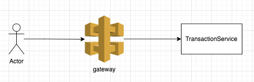
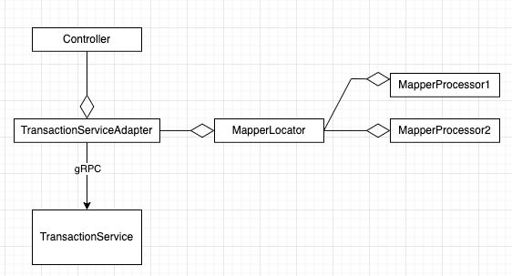

# Pemo
Coding challenge

## The problem:
At Pemo, we manage transactions from multiple processors, each having unique transaction structures. We aim to create a scalable solution capable of effortlessly accommodating an unlimited number of processors.
Your task is to design a system to realize this objective. The solution should encompass a software design as well as the implementation of two services using NestJS, Sequelize, Postgres,
and gRPC.

## Component Diagram:

## Class Diagram:

The API has responsibilities:

- Routing the requests to the specified service
- Map the processor's data into unified data structures Pemo services knows
- Authorization and Authentication

